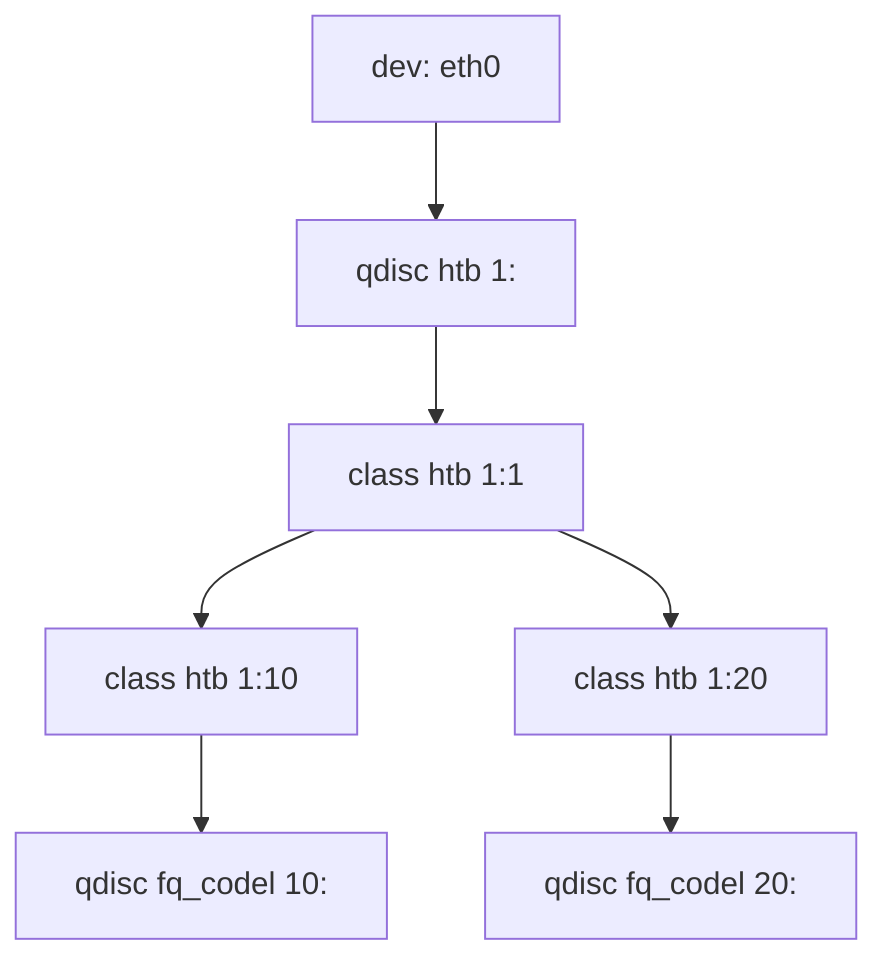

# Traffic Control Linux (TC)

## Commandes JSON

```bash
tc -j qdisc show
tc -j class show
```

Les sorties JSON permettent de reconstruire la topologie des files (`qdisc`) et des classes (`class`) a partir des champs principaux:

- `dev`
- `kind`
- `handle`
- `classid`
- `parent`

## Exemple de hierarchy



## Bonnes pratiques

- Garder une classe racine explicite (`1:1`) sur les arbres HTB.
- Eviter les collisions de `handle` et `classid`.
- Utiliser des noms de device coherents (`dev`).
