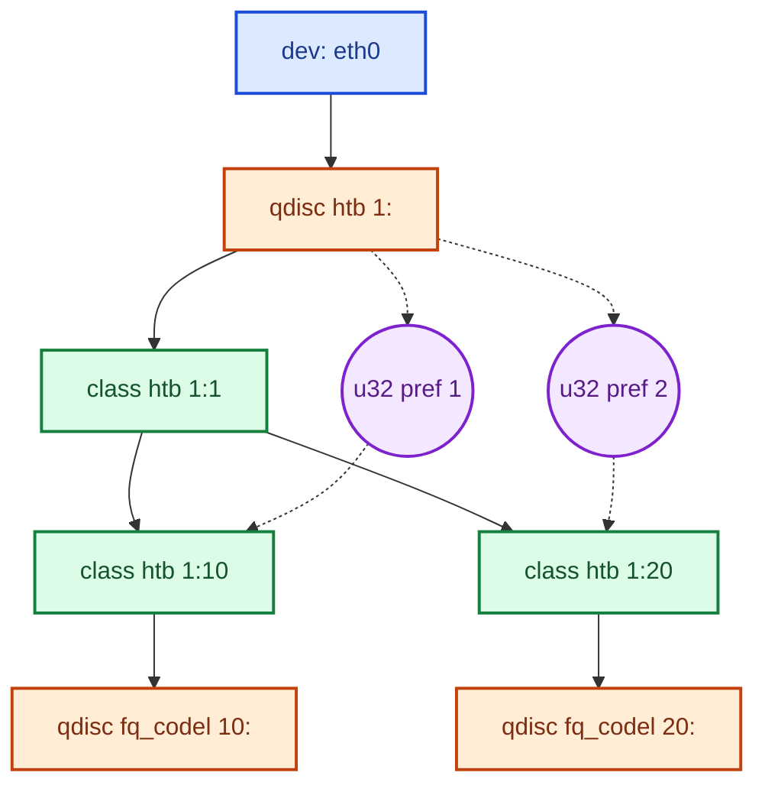

# Traffic Control Linux (TC)

## **1. Afficher la configuration actuelle**

```bash
tc qdisc show                          # Affiche les disciplines de file d'attente (qdisc) sur toutes les interfaces
tc -s qdisc show                       # Affiche les statistiques
tc -j qdisc show                       # Sortie en JSON

tc class show dev eth0                 # Affiche les classes de trafic configurées sur une interface
tc -s qdisc show                       # Affiche les statistiques
tc -j class show dev eth0              # Sortie en JSON

tc filter show dev eth0                # Affiche les filtres de trafic configurés sur une interface
tc -s qdisc show                       # Affiche les statistiques
tc -j filter show dev eth0             # Sortie en JSON
```

Voir aussi: [exemple complet de configuration TC](https://github.com/thibaultleblanc/tc-visualizer/blob/master/test/example_tc_config.sh)

## Exemple de hierarchy

- <span style="color:#1d4ed8"><strong>Interface reseau</strong></span>
- <span style="color:#c2410c"><strong>Qdisc</strong></span>: discipline de file d'attente
- <span style="color:#15803d"><strong>Class</strong></span>: classe de trafic
- <span style="color:#7e22ce"><strong>Filter</strong></span>: regle de filtrage



**Lecture rapide**

Le flux part de l'interface vers la qdisc, descend dans les classes, puis chaque bulle de filtre indique une regle de classification appliquee sur la qdisc et redirigee vers une classe precise.

**QDISC (Discipline de file d'attente)**

- Gère la file d'attente, le shaping et l'ordre d'émission des paquets
- **Classful** (autorisant des classes enfants):
  - HTB
  - CBQ
  - PRIO
  - ... → man tc
- **Classless** (file unique, pas de classes):
  - FIFO
  - SFQ
  - TBF
  - ... → man tc

**CLASS (Classes de trafic)**

- Subdivisions d'une QDISC classful
- Allocation de bande passante hiérarchique
- Forment un arbre (classe parent → classe enfant → …)

**Filter (Filtres de trafic)**

- Routent les paquets vers les bonnes classes
- Basés sur des critères: adresse IP, port, protocole, etc.
- Relient la QDISC porteuse aux classes cibles via des règles (`u32`, `fw`, `bpf`, ... → man tc)

## Bonnes pratiques

- Garder une classe racine explicite (`1:1`) sur les arbres HTB.
- Éviter les collisions de `handle` et `classid`: utiliser une convention claire (ex: `X:` pour les qdiscs et `X:Y` pour les classes sur le même device, avec X unique par interface).
